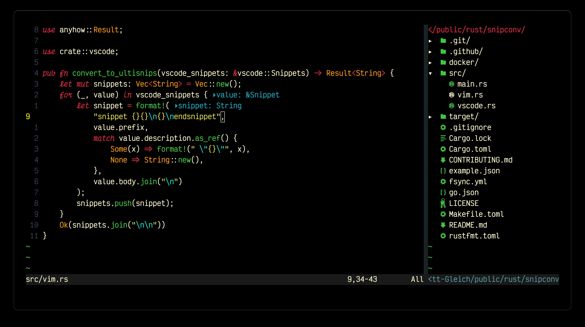

# vim

🏴 blackbird theme for vim

## 🚀 Install

You can install using [vim-plug](https://github.com/junegunn/vim-plug):

```vim
Plug 'blackbirdtheme/blackbird.vim'
```

Once you have it installed just set it as your theme:

```vim
colorscheme blackbird
```

## 📷 Example



## 🤝 Polygot

For improved syntax highlighting I highly recommend that you use the [vim-polygot plugin](https://github.com/sheerun/vim-polyglot). blackbird.vim is designed to work alongside vim-polygot.

## 🌃 Other Implementations

- [Visual Studio Code Theme](https://github.com/blackbirdtheme/blackbird)
